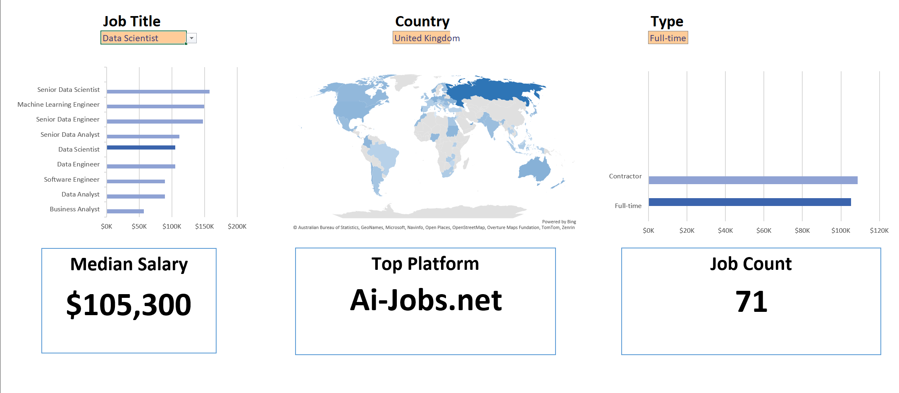

# 📊 Salary Dashboard – Excel Project

An interactive Excel dashboard for analyzing tech/data job salaries based on job title, country, and work type.

---

## 💡 About the Project

This Excel-based dashboard enables users to:
- Select a **Job Title**, **Country**, and **Job Type** from dropdowns
- Instantly view:
  - Median salary
  - Top hiring platform
  - Total job count matching filters
- Visualize hiring trends with:
  - Salary comparison bar charts
  - Job count by schedule type
  - Interactive world map of job availability

Ideal for recruiters, analysts, job seekers, or hiring managers who need quick, data-driven insights on market demand and compensation.

---

## 📁 Project Files

- `Salary_Dashboard.xlsx` – Main Excel dashboard
- `dashboard-preview.png` – Screenshot of the dashboard
- `Project_Documentation.md` – Full technical breakdown
- `README.md` –

---

##  Key Excel Functions Used

- `MEDIAN(IF(...))` – to calculate filtered median salary
- `COUNTIFS(...)` – to count jobs by multiple filters
- `XLOOKUP(...)` – to find the top hiring platform
- `SEARCH(...)` – for partial match filtering in job types
- `FILTER + SORT` – to build dynamic dropdowns and tables

---

##  Visuals

- Metric cards for Salary, Platform, Job Count
- Horizontal bar charts for Job Title and Job Type insights
- Map chart showing country-wise job spread (based on cleaned location data)

---

##  Known Limitations

- Some country names may not render correctly in map visuals
  
---

##  Future Improvements

- Improve data validation and cleaning for map compatibility
- Use conditional formatting to highlight low or missing data
- Convert to Power BI or Google Data Studio version

---

## Why This Project Matters

This project demonstrates:
- Advanced Excel proficiency
- Strong understanding of dashboard design and user experience
- Real-world application of analytics to job market data

 
---

## 📸 Preview

---

